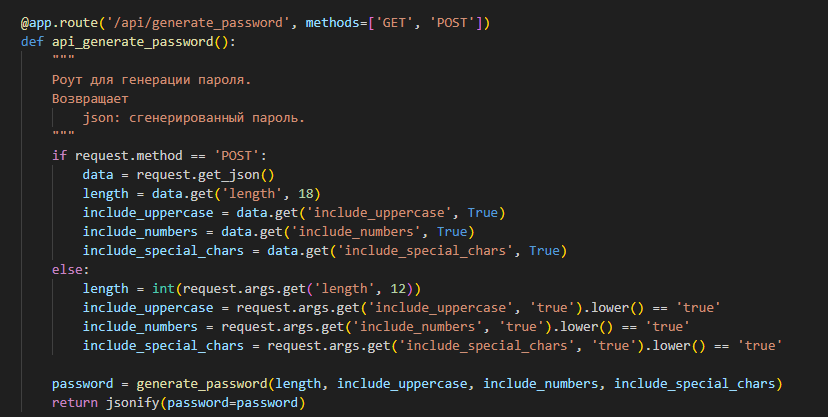
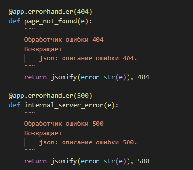
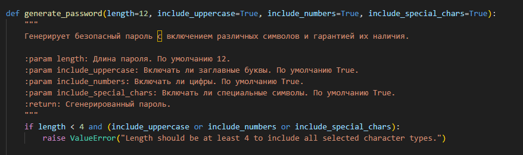
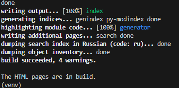
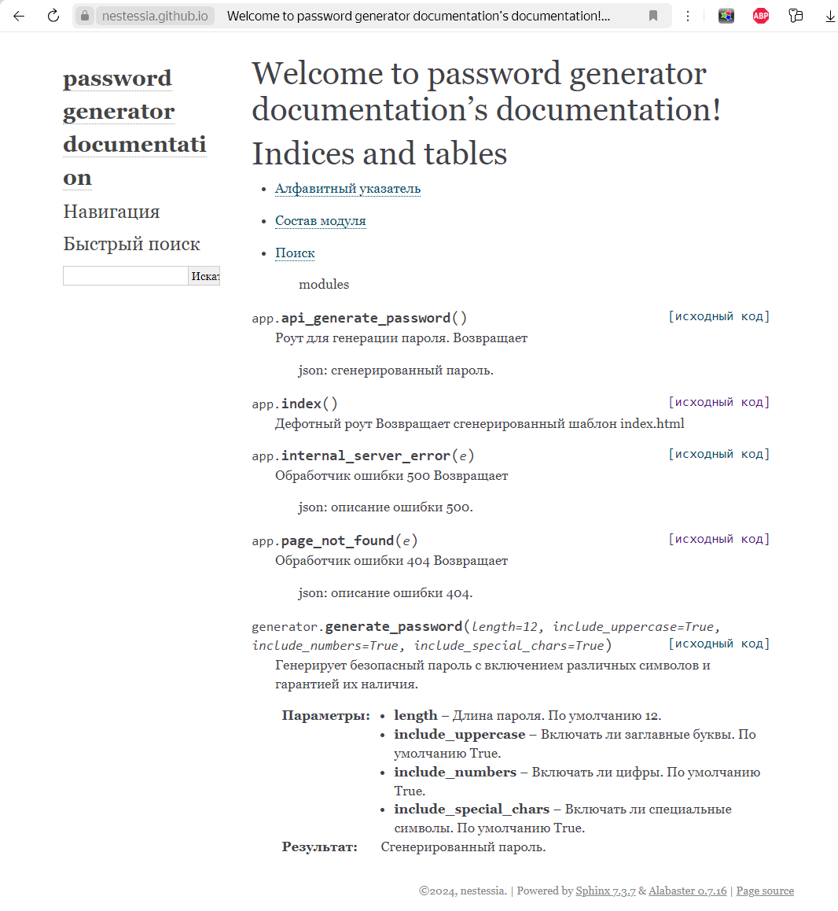

# Лабораторная работа 8
# Создание документация с использованием Sphinx

### Описание
Чтобы создать документацию, неободимо выполнить следующее:

В вашем коде должны быть докстринги с описанием функций:



Установка библиотеки
```
pip install sphinx
```
Инициализация Sphinx
```
sphinx-quickstart
```
Настройка конфигурации Sphinx. Отредактируйте файл conf.py
```
import os
import sys
sys.path.insert(0, os.path.abspath('..'))
```
Использование sphinx-apidoc для генерации файлов .rst
```
sphinx-apidoc -o source ../
```
Создание HTML-документации
```
sphinx-build -b html source build
```


[Ссылка на gh-pages]("https://nestessia.github.io/rgpu_6sem/")

[Ссылка на ветку]("https://github.com/nestessia/rgpu_6sem/tree/docs")