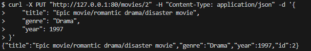

# Лабораторная работа 9. Проект на FastAPI. <b>API для сохранения фильмов</b>
Автор: Крючкова Анастасия Сергеевна ИВТ 1.2
## Описание проекта
Данная API позволяет сохранить в базу данных информацию о фильмах, указавыя название, жанр и дату выпуска
## Стек
FastAPI | docker-compose | sqlalchemy | postgres
## Развернуть проект
Находясь в директории /lr9, выполните команду (Предварительно включив впн, так как будет скачиваться образ postgres):
```
docker-compose up --build
```
В docker-desktop запустится compose

## Примеры запросов
<b>POST</b>
```
curl -X POST "http://localhost:80/movies/" -H "Content-Type: application/json" -d '{
    "title": "Titanic",
    "genre": "Drama",
    "year": 1997
}'
```
RESPONSE: {"title":"Epic movie/romantic drama/disaster movie","genre":"Drama","year":1997,"id":1}


<b>GET</b> Получить список всех фильмов
```
curl -X GET "http://127.0.0.1:80/movies/"
```
RESPONSE: [{"title":"Epic movie/romantic drama/disaster movie","genre":"Drama","year":1997,"id":1}]


<b>DELETE</b> Удалить фильм по id
```
curl -X DELETE "http://127.0.0.1:80/movies/1"
```
RESPONSE: {"message":"Movie deleted successfully"}


<b>PATCH</b> Частично изменить объект
```
curl -X PATCH "http://127.0.0.1:80/movies/2" -H "Content-Type: application/json" -d '{
    "title": "Titanic (Updated)"
}'
```
RESPONSE: {"title":"Titanic (Updated)","genre":"Drama","year":1997,"id":1}

<b>PUT</b> Полность изменить объект
```
curl -X PUT "http://127.0.0.1:80/movies/2" -H "Content-Type: application/json" -d '{
    "title": "Epic movie/romantic drama/disaster movie",
    "genre": "Drama",
    "year": 1997
}'
```

RESPONSE: {"title":"Epic movie/romantic drama/disaster movie","genre":"Drama","year":1997,"id":1}

